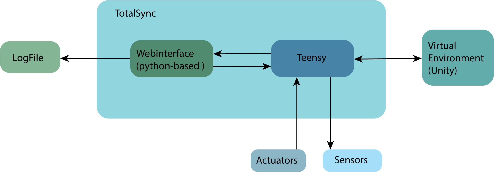
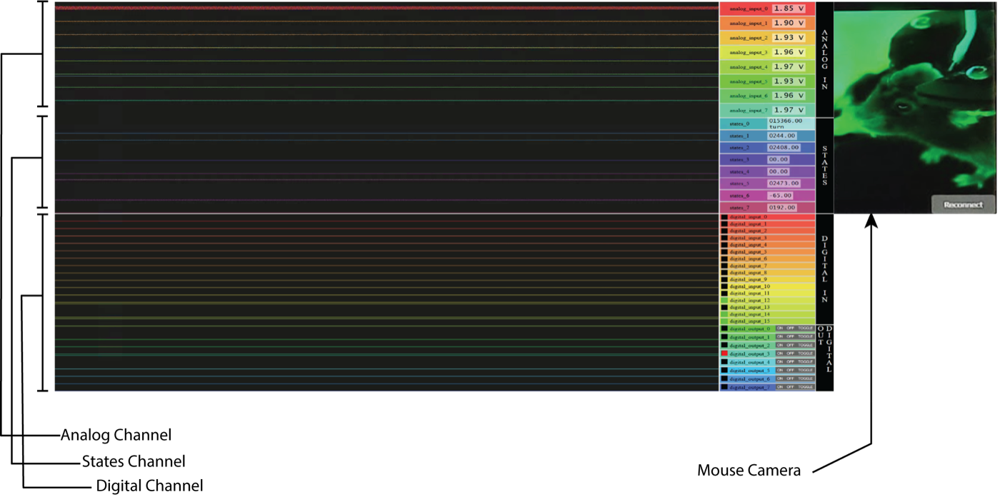

# TotalSync

[](https://pypi.org/project/totalsync/)
[](https://pypi.org/project/totalsync/)
[](https://totalsync.readthedocs.io/en/latest/)
[](LICENSE)

TotalSync is a low-cost, open-source teensy-based synchronization system for multiple
recording techniques.

```bash
uv tool install totalsync
```

**[Read the documentation →](https://totalsync.readthedocs.io)**

<p align="left">
  
 </p>

## Getting started

 * **[General Introduction to TotalSync](docs/introduction.md)**
 * **[Installation](docs/installation.md)**
 * **[Quick start](docs/quickstart.md)**
 * **[Pin usage](docs/pin-usage.md)**
 * **[Extending TotalSync for new devices](docs/extending.md)**
 * **[Videos and images](docs/images)**

## Command reference

 * **[`totalsync`](docs/totalsync.md)** — record a session and serve the live
   browser interface
 * **[`totalsync-decode`](docs/totalsync-decode.md)** — decode recorded `.b64`
   files into numpy, MATLAB or pynapple formats, with named channels
 * **[`totalsync-pinsheet`](docs/totalsync-pinsheet.md)** — generate the
   `pinSheet.json` channel map from the Teensy firmware source
 * **[`totalsync-pinout`](docs/totalsync-pinout.md)** — draw that channel map onto a
   labelled picture of the Teensy, to check a wiring job at the bench
 * **[`totalsync-2p`](docs/totalsync-2p.md)** — align ScanImage two-photon
   recordings with TotalSync telemetry

## Recording techniques

 * **[Voltage sensitive imaging](docs/vsi.md)**

Chapters for two-photon microscopy, electrophysiology / Neuropixel and virtual reality
are planned; their placeholder files under `docs/` are not part of the site yet.

## Repository layout

This is a [uv workspace](https://docs.astral.sh/uv/concepts/projects/workspaces/) of
four distributions. `pip install totalsync` gets all of them; each is also installable on
its own, so a machine that only analyses recordings need not pull in the serial and GUI
dependencies.

| Path | Distribution | Provides |
| --- | --- | --- |
| `packages/totalsync_webinterface` | `totalsync-webinterface` | `totalsync` — acquisition, recording and the live browser interface |
| `packages/totalsync_utils` | `totalsync-utils` | `totalsync-decode`, `totalsync-pinsheet`, `totalsync-pinout` |
| `packages/totalsync_2p` | `totalsync-2p` | `totalsync-2p` |
| `.` | `totalsync` | umbrella that depends on the three above |

`Teensy41_Totalsync/` holds the firmware, and `docs/` the documentation above.

## Contribute

Please contact Morgane Audrain (morgane.audrain@donders.ru.nl) with questions or
concerns.
